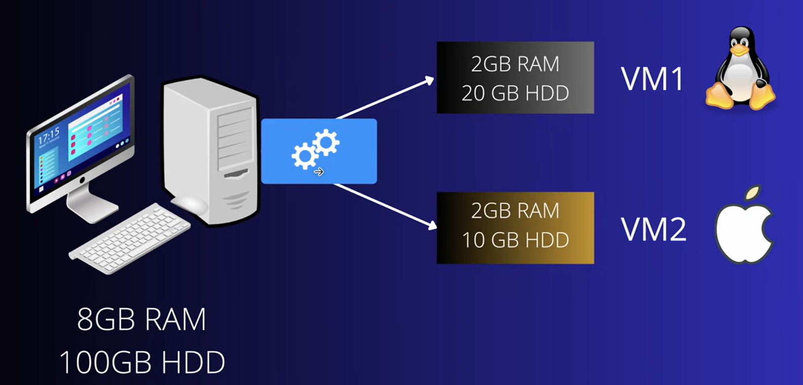

# 1. Virtualization

Virtualization is the process of creating multiple virtual machines or environments from one physical computer to use resources more efficiently.

It is layer on your root machine which help to run the virtual machines. [Windows | Virtualization(layer) | Linux]

More than one virtual machine can be run on this virtualization layer

### Why we need Virtualization
1) Suppose you want to practice for Linux on your Window Machine
2) Your are developer and wanted to test the software for Windows and Linx both on single machine

### Hypervisor
Software that create and run virtual machines. e.g Oracle VirtualBox

**How Hypervisor work** :
- Virtual box share hardware resources from Host OS
- Separate set of virtual CPU, RAM, storage etc
- VMS are fully isolated (independent of hosted OS)

**Benefits of VM** : 
- We don't need new resources to use different OS
- No risk of any issues with your primary OS
- Testing any app on different OS

#### Types of Hypervisor

**Type1 : Bare Metal** :
- No Host OS, setup on hardware itself
- It has basic OS needed to get setup on hardware, as we need OS to setup hypervisor
- Used by cloud provider and enterprise servers
- e.g VMware vSphere

**Type2 : Hosted** : 
- Setuped on Host OS
- e.g Oracle Virtual Box