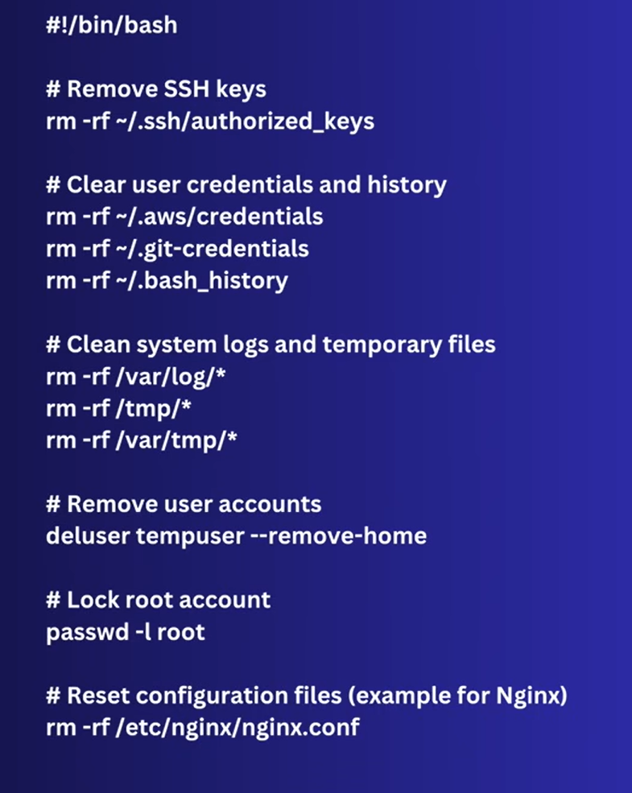
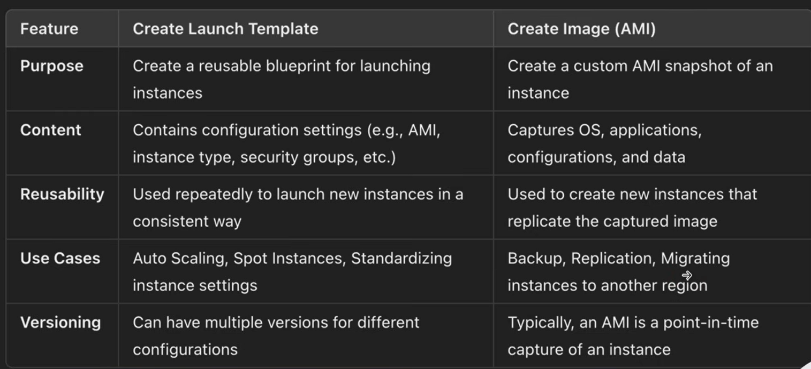

# AWS AMI (Amazon Machine Image)
AMI is a pre-configured template that provides necessary informatoin to launch an EC2 instance in AWS.

**It Includes** :
- Operating System (e.g Linux, Ubuntu, Window)
- Application Server (e.g Apache, Nginx)
- Pre-installed Softwares and Configuratoins

With an AMI, you can launch new EC2 instance with consistent, predefined configuraiton.

You can also create custom AMIs to include specific software or settings, allowing for quick replication of environments.

### Create AMI of Instance
- Select Instance (e.g WebserverTESTING) > Actions > Image and Templates > Create Image
- Set the detail and click create image

### Create Instance from Image
- EC2 Sidebar > Images > AMIs
- Select AMI (e.g webserver-window-v1) 
- Click `Launch Instance from AMI`

We get the same server (WebserverTESTING) with its AMI for WebserverPROD without configuring anything, without installing any server, without deploying our custom website, because of AMi of WebserverTESTING.

### Types of AMIs
1. **Public AMIs** : Available to all AWS users. Useful for basic usecase like populor Operating Systems. e.g Ubuntu, CentOS
2. **Private AMIs** : Created by user and only available within that account or shared with specific account.
3. **Paid/Marketplace AMIs** : Provided by third parties through AWS marketplace, offering software like databases, web servers, or predefined environments.

    **Benefits** :
    - **Rapid Deployment :** Get the pre-configured AMIs, e.g for LAMP stack application. Eliminating the need of manually install and configure Apache, MySQL, PHP
    - **Scalability and Load Balancing :** Running on AWS enable quick scaling to match website traffic, while Elastic Load Balancer helps in distributing requests.
    - **Cost Efficiency :** You only pay for Infrastructure and the software according to your usages.

    Rather than creating EC2 instance and installing configuring server, softwares. We can use Marketplace AMIs (Paid) for faster deployment.

    **note** : Paid AMIs its production ready

### Cleanup Script
Do Cleanup before creation of EC2 instance from AMI (best practices)

### Create Launch Template
- EC2 Sidebar > Launch Templates > Create Launch Templates
- My AMIs > Select AMI (you owned)
- Select Configuratoins > Launch Template

- Go to Launch Templates > Action > Launch Instance from Template

    Now we can create any number of instance with this template

**Benefit** : If you need to create lots of instance and configuration (like OS, Network) are same most of the time in such case template help to create instance faster and without configuring the same configuration for new instances.

### Key Difference 

### Summary
- All installed applicatoins, configuration setting, network configuration, environment variables, DNS Settings, users, and firewall settings will be included in AMIs.
- An AMI is essentially a complete snapshot of the instance at the point in time you created the image, allowing you to replicate the exact state of server, including all softwares, configurations, OS level changes.
- When you create a EC2 instace from this AMI, it will boot up as if it were an exact clone of the original, with all installed software and settings intact.

### EC2 Image Builder
- Automate VM or Image Creation
    - Creation, testing, deployment of AMIs
- Can be configured to run at regular intervals (e.g daily, weekly, monthly)
- Free of cost