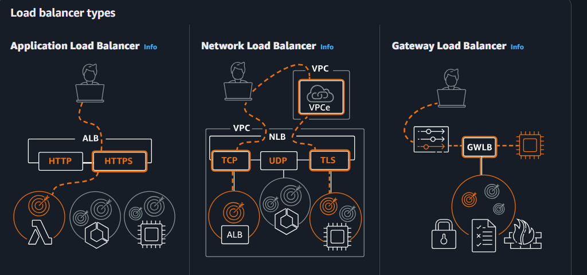

# AWS ELB (Elastic Load Balancing)
AWS ELB (Elastic Load Balancing) is an AWS service that automatically distributes incoming network traffic across multiple targets (such as EC2 instances, containers, IP addresses, or Lambda functions). This improves an application's availability, scalability, and fault tolerance.

- Distribute Traffic
- Improve Availability
- Scales Resources
- Signle point of access need to be expose
- High Availability across AZs

#### Scalability
- Abality of system to handle increasing amount of work by adding more resources while maintaining acceptable performance.

#### Vertical Scalability (Scale Up)
- Adding more power (CPU, RAM, Storage) to a single machine.
- e.g t3.micro to m5.large

#### Horizontal Scalability (Scale Out)
- Adding more machines (servers) to handle more load, instead of adding more resource to single machine(server).
- You can add more EC2 instances behine a load balancer

#### High Availability (HA)
- HA means keeping your service up and running with minimal downtime, so it's always accessible to users.
- e.g Running resources in multiple AZs (Availability Zones)

#### Elasticity
- Ability to automatically adjust resource as the demand changes. Adding more resource when needed and removing when it's no longer necessary.
- e.g ASG (Automatic Scaling Group)

### When to use which?
#### Use vertical scaling when:
- Your application runs well on a single machine.
- Downtime for hardware upgrades is acceptable.
- Simplicity is more important than massive scale.

#### Use horizontal scaling when:
- You expect millions of users or very high traffic.
- High availability and fault tolerance are important.
- You want the flexibility to add or remove servers as demand changes.

### Load Balancer
A load balancer is a component that distributes incoming network traffic across multiple servers so that no single server becomes overloaded.

### Types of AWS Load Balancers

#### 1. Application Load Balancer (ALB)
- Operates at **Layer 7 (HTTP/HTTPS)**.
- Best for web applications and microservices.
- **Features:**
  - Host-based routing (e.g., `api.example.com`, `app.example.com`)
  - Path-based routing (e.g., `/images`, `/api`)
  - SSL/TLS termination
  - WebSocket and HTTP/2 support

#### 2. Network Load Balancer (NLB)
- Operates at **Layer 4 (TCP, UDP, TLS)**.
- Designed for ultra-high performance and low latency.
- Can handle millions of requests per second.
- Supports static IP addresses and preserves the client IP.

#### 3. Gateway Load Balancer (GWLB)
- Used to deploy and scale virtual network appliances such as firewalls and intrusion detection systems.
- Operates at **Layer 3 (Network Layer)**.

#### 4. Classic Load Balancer (CLB) *(Legacy)*
- Supports both Layer 4 and Layer 7 features.
- Intended for older applications.
- AWS recommends using ALB or NLB for new deployments.

### Creating and Configuring LB
- Go to EC2 > Sidebar (Load Balancing) > Load Balancer
- Click `create load balancer` > `ALB` as we have HTTP request > `create`
- Schema : `Internet Facing` (for public) , `internal` (for private) > `IPV4`
- Network Mapping > Availability Zone (select all needed)
- Listeners and Routing > `Target Group` (create target group if not)
    - select `instance` > protocol (HTTP) > IPV4 > `next`
    - select available `instance` (of same region) > `include as pending below` > `next`
    - `create target group`
- Create Load Balancer
- Copy Load Balancer DNS and use it with (http:// as of now)