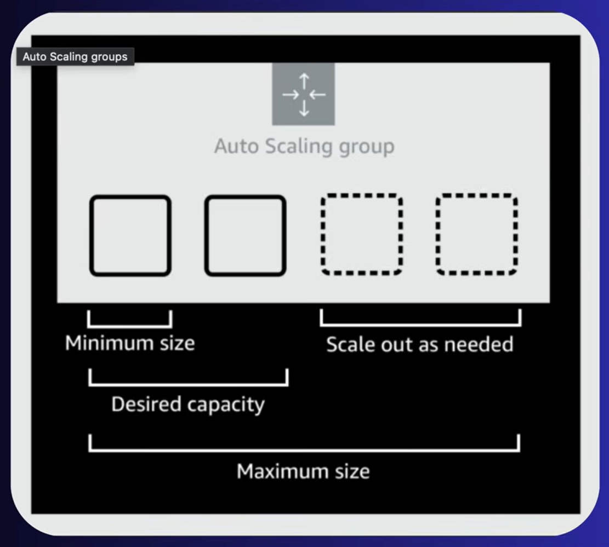
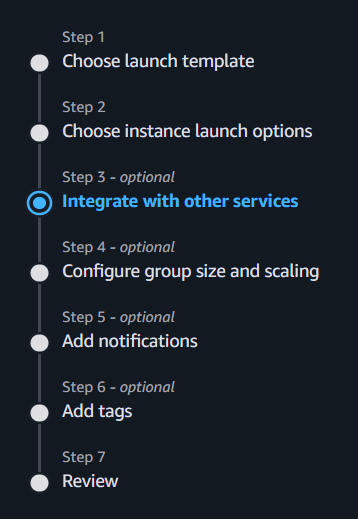

# AWS ASG (Auto Scaling Group)
ASG is a service that automatically adds or removes EC2 instances based on the demands to ensure your applicatoin is always available.

It helps scale up when more capacity is needed, and scale down during low usage to save costs, keeping the right numebr of servers running at all time.

#### Functions
1. **Automatic Scaling** : Scale the number of EC2 instances up or down based on demands.
2. **Maintain Instance Health** : Replace unhealthy instances automatically to ensure reliability. 
3. **Use Scalling Policies** : Set rules for scaling based on metrics like CPU usage or request count.
4. **Ensure Availability** : Always keep a defined number of instances running to meet application needs.
5. **Schedule Scaling** : Pre-configure scalling activities for specific time (e.g traffic peaks)
6. **Distribute Instances** : Deploy instances accross multiple availability zones for high availability.
7. **Integrate with ELB** : Attach instances to ELB to automatically balance traffic.
8. **Optimize Costs** : Scale down during low demand to save on infrastructure costs.

**note** : It does not manage instances created before ASG creation

### Steps to create ASG
- Launch Template or Configuration
- Create Auto Scaling Group
- Select VPC and Subnets
- Attach Load Balancer (Optional)
- Configure Scaling Policies
- Health Checks
- Add Notifications (Optional)
- Review and Create

