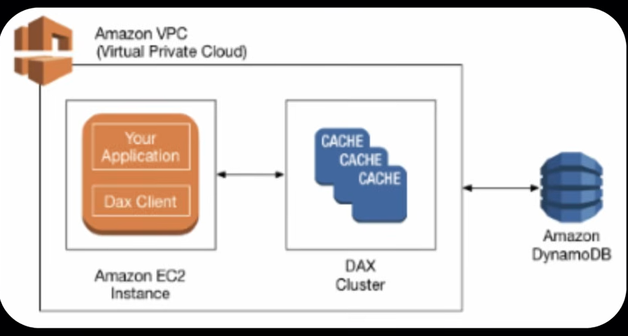

# AWS DynamoDB
It is a fully managed, serverless, key-value and document NoSQL database service provided by AWS. That delivers single-digit millisecond performance at any scale.

DynamoDB stores data as items in tables, with each item represented as a JSON-like document consisting of key value pair.


### Lets Start
- **Create Table**: Selct create table, name, partition key, create table.
    - Partition Key is same as primary key
- **Flexible Data**: Can create and insert any data (no particular format) of any type (string, number, etc)
    - **Data 1** : {"id":01, "name" : "Saddy", "smart": true}
    - **Data 2** : {"id":02, "name" : "Sandy", "age" : 22, "bright": true}
- **Create Indexes** : By default indexes will be created for Partition Key, but can create for other also (e.g username)
    - **General Secondary Index** : A GSI lets you query a DynamoDB table using a different partition key/sort key than the table's primary key. **Example:** email 
    - **Vector Index** : A vector index is used for similarity search on vector embeddings, typically for AI/RAG applications.


### Key Points
- **Serverless:** AWS maange the servers, storage, scaling and infrastructure for you.
- **Automatic Scaling:** Instantly scales up or down based on demand, with no manual adjustments needed.
- **Zero Downtime:** Provides continuous availability without maintenance windows.
- **On-Demand Pricing:** Pay only for the read/write requests used, ideal for fluctuating workloads.
- **Idle Cost Savings:** Scales down to zero during inactivity, so there's no cost when tables have no traffic.


### Handeling Traffic
- **Provisioned Capacity** :
    - **Auto Scalling** : Capacity automatically adjusts based on utilization.
    - **Static** : Fixed read/write capacity units (RCU (Read Capacity Unit)/WCU (Write Capacity Unit)) configured manually.
- **On Demand Capacity** : Pay per request; DynamoDB automatically handles capacity scaling with no need to configure RCU/WCU.


### Backup
To prevent data loss from accidential delete or overwrite. AWS provide Point-In-Time Recovery
- On Demand Backup : Backup when you need this, manually or automation trigger it.
- Schedule Backup : Take backup at specific interval and specific time. e.g Backup daily at 2AM


### Additional Settings
- Deletion Protection
- Time to Live (TTL) : Automatically delte expired items from table
- Encryption


### Create Simple Node Appliication with DynamoDB
- Create EC2 Instance >> Connect
```bash
sudo yum install docker -y
sudo systemctl start docker
sudo systemctl status docker
sudo docker pull philippaul/node-dynamodb-demo
sudo docker run --rm -d -p 80:3000 --name node-dynamo-app -e AWS_REGION=eu-north-1 -e AWS_ACCESS_KEY_ID=access-key -e AWS_SECRET_ACCESS_KEY=secret-key philippaul/node-dynamodb-demo

sudo docker ps
```

- Access through EC2
    - Go to IAM Roles >> Create role
    - Select EC2 Instance >> Actions >> Security >> Modify IAM Role  
    - Create and Attach IAM role to EC2 instance


### Dynamo Accelerator - DAX
- Fully managed in-meemory cache for DynamoDB
- DAX offers microsecond latency achieving upto 10x performance over standard dynamodb queries
- High Availability and Scalability : can be deployed in multiple AZs
- DAX is only used for and is integrated with dynamodb, while elasticCache can be used for other databases



### DynamoDB Global Table
Global Table is used when u want the same DynamoDB data available in multiple AWS Regions.