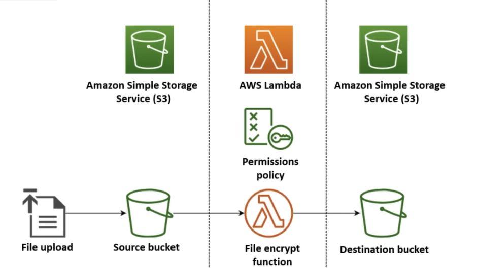

# AWS Lambda Function

AWS Lambda is a serverless computing service, that let you run code in response to events without managing servers.

You just upload the code, and AWS automatically handles the rest, scaling as needed and only charge for the time your code runs.

### Create Function
- Available Languages `Java`, `Node.js`, `.NET`, `Python`, `Ruby`
- Click `Create a Function` > Function Custom Details > Create Function
- Function is created but need an event to call it : `Create Event/ Test Event`
- After every changes deploy the changes to see in the function call

### Create Event and call Lambda from S3
- Should have atleast any one S3 bucket or create a new one
- Select the Lambda Function and click on `Add trigger`
- Select even type : could be - POST, PUT, COPY, Multipart Upload, Delete, Restore, etc
- Add Prefix or Suffix (Optional)
    - Prefix = "Only trigger for files whose path/name starts with this."  `Ex : Uploads/img.jpg`
    - Suffix = "Only trigger for files whose name ends with this."  `Ex : .jpg`
- Upload File to S3 and check the log of Lambda Funciton
- S3 will create one notification event which will notify Lambda funciton
- S3will **need permission** (by default [basic permission] created during trigger creation) to trigger Lambda Function

### AWS Lambda Limitations
- Execution Time Limit : Lambda function can run for maximum of 15 minutes, if you need longer running task, Lambda function might not be the best choice
- Stateless : Lambda funciton don't keep the state between invocations, so they are best for tasks that do not require long term memory
- Cold Start Delays : If lambda function has'nt started for a while it be slight delay - called a codl start, when it startup. This can add little latency, but AWS provides way to mitigate it for critical functions.

### When to use Lambda Functions
- Image Processing : Lets say user uploads a iamge to your app, Lambda can be used to resize, compress, apply filters to images
- Data Transformation : If you need to cleanup data before storing it to database, lambda funciton can handle that transformation automatically 
- Real-Time Notifications : When event happen like - new user signup. you can send email/sms or other notifications instantly using lambda functions.

### Features of Lambda Function

#### Event Driven Execution
Lambda is a event-driven service, meaning it runs your code in response to certain triggers or events.

These events can come form aws services like :
    - S3(file uploads)
    - DynamoDB(database changes)
    - API Gateways(HTTP requests)
    - CloudWatch (scheduled events), etc

#### Automatic Scaling
AWS Lambda automatically scales the execution of function in resopnse to incoming number of requests.

If a thousands requests comes in the same time, in backend it will create multiple functions (horizontal scaling) to handle the incoming requests.

#### Pay as you go
Lambda uses pay-as-yo go pricing model, you are billed based on the number of funciton executions and the duration of each function's runtime.

### Example
