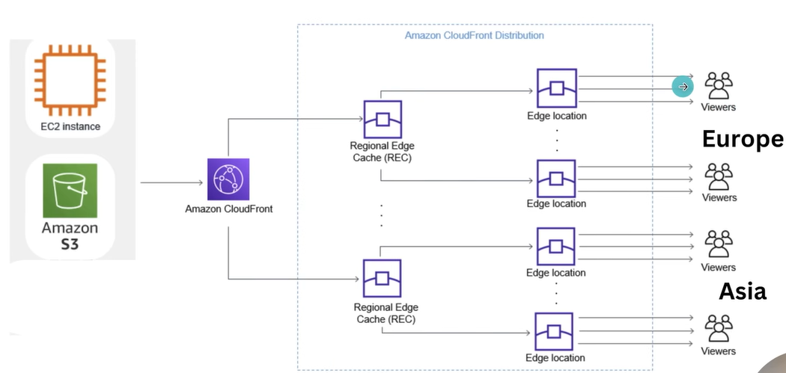
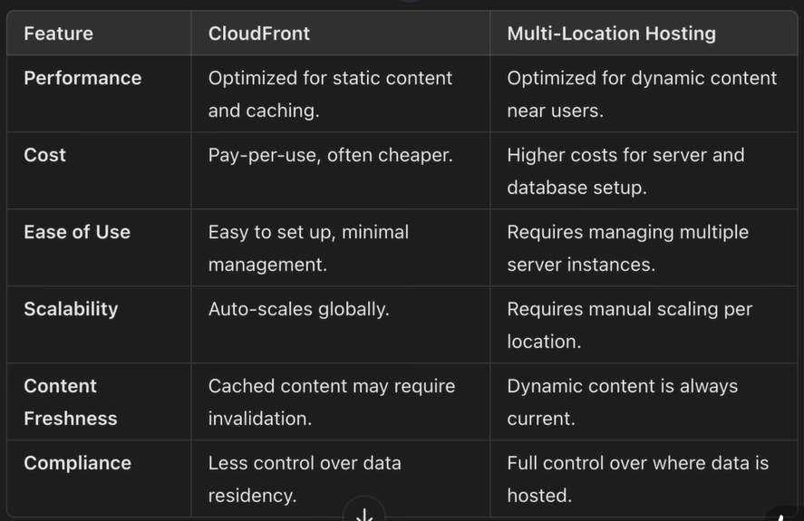

# AWS CloudFront CDN
If you want to provide your service or want the user to access your website with low latency, then for this we need to create multiple instance based on geolocation or other factor. To serve the user with low latency, but this will required more costing/billing. 

Solution : CDN

AWS Cloudfront is CDN(Content Delivery Network) that speed up the delivery of web content to users by caching it at server (edge location) close to them, improving load time and performance globally.

AWS CloudFront basically cache the static content like images, CSS, JavaScript and Videos. It also cache dynamic content (e.g HTML, API responses) if configured with caching policies and headers.

By default sensitive or user-specific data and backend logics are not cached. Cache behaviour is controlled by TTLs, cache behaviors and origin headers.

**note** : It is a Global Service (not region specific)

### Get Started with CloudFront
- Create Distribution
    - Name, Policy
    - Enable Firewall, IPv4
    - Define Root Access : index.html
    - Create Distribution : Gets - Policy (copy)
- Open S3 bucket > Permissions > Edit Policy > paste copied CloudFront Policy > Save
- Get the : Domain Name (.cloudfront)

### Difference between CloudFront and Multi-Location Hosting
