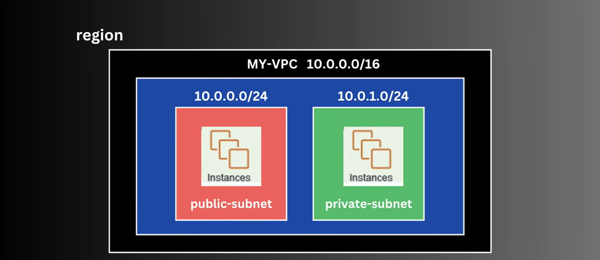
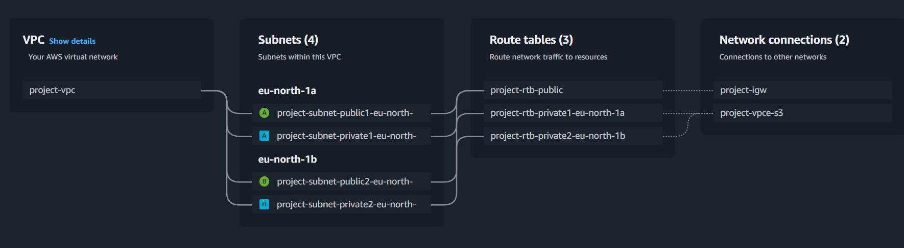
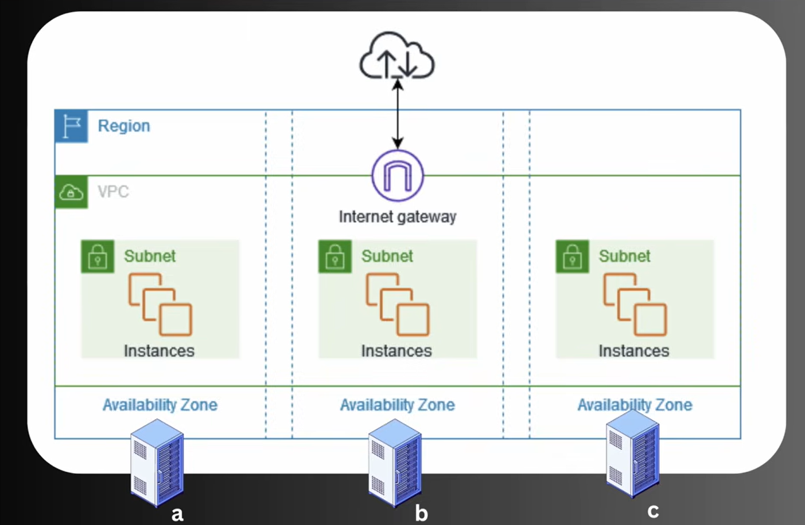

# AWS VPC (Virtual Private Cloud)
A private, isolated network within the AWS cloud. Where you can launch and manage your resources securely.

**Why?** : To securely isolate and control network environment.

Normally multiple user use the shared network for there instance (e.g EC2 instance)

### Region
City in which AWS datacenter are located, and divided in [USA, Eurpoe, ASIA]

[ASIA : North, East, Sout]

[South-Asia : Singapore, Mumbai, Hyderabad, Tokyo]

**AZ**: For each region there are multiple AZs(Availability Zones)

### CIDR (Classless inter domain routing)
It is a method for allocating IP addresses and routing internet protocal packets.

**VPC CIDR Block** : Defines the IP addresses range for the entire VPC

present in range /28 to /16
- 10.0.0.0/16 : this block allows for 65,536 IP addresses
    - 10.0.0.1 to 10.0.255.255
- 10.0.0.0/28 : this block allows for 16 IP addresses

**Subnet CIDR Block**: Should be within the VPC range
- Public Subnet : 10.0.1.0/24
- Private Subnet : 10.0.2.0/24

To know more about the CIDR refer : CIDR.xyz (website)

### Important Components
#### Subnet
Subnet is a smaller, segmented part of a larger network that isolates and organizes devices within a specific IP address range.

#### Route Table
Route table is a set of rules, called routes, that are used to determine where the network traffic from your subnet or gateway is directed. Each subnet in your VPC must be associated with a route table, which controls the routing for that subnet.

#### Internet Gateway
An Internet Gateway is a component that allows communication between instance in your VPC and the internet

#### Security Groups
Network firewall rules that control inbound and outbound network traffic for instances.
 
**note**: It is Instance Specific

#### Network ACL(Access Control Lists)
Optional layer of security for your VPC that acts as a firewall for controlling traffic in and out of one or more subnets.
 
Allow and Deny Rule, while in security gorups only have allow rules.

#### NAT (Network Address Translation) Gateway
Enables instances in a private subnet to connect to the internet or other AWS services, but prevents the internet from initiating communication to those instances.
 
- It is specific to subnet. 
- It is one way communication

#### VPC Peering
A networking connection between two VPCs that enables you to route traffic between them privately.

#### VPC Endpoints
Allows you to privately connect your VPCs to supported AWS services and VPC endpoint servics powered by AWS PrivateLink.
 
Example : Instance in VPC want to connect to S3 Bucket

#### Bastion Host
A special-purpose instance that provides secure access to your instances in private subnets.   

#### Elastic IP Addresses
It provide a static IP addresses designed for dynamic cloud computing.

#### VPC Flow Logs
Capture information about the IP traffic goining to and from the network interfaces in your VPC.

#### Direct Connect
Establishes a dedicated network connection from your premises to AWS.

#### AWS Client VPN
Managed VPN service that enables a secure remote access to your AWS resources and on-premises network using Open-VPN based clients.

### Get Started with VPC
- Select the Region
- specify CIDR block
- Create VPC
    - name
    - IPV4 CIDR Block
- Flow : VPC --> Subnet(public, private) --> Route Table --> Network Connections

### Practical with VPC
#### VPC Creation
- Create VPC > VPC Only (as of now we only wnat VPC not subnet)
- Give name, select IPV4 CIDR Block : (10.0.0.0/20)
- IPV6 CIDR Block (optional)

#### Subnet Creation
- Select VPC to which subnet will be created
- Name, Availability Zone, 
- Subnet CIDR Block Range : (10.0.1.0/24)

#### Route Table
- By default when VPC is created, main route table is cretaed for that VPC
- Create Route Table > Name > Select VPC

#### Internet Gateway
- Create Internet gateway, just require name 
- Select Internet Gateway > Action > Attach to VPC

- Associate Subnet (Public) to route table
- Create new Route , expose to internet, attach internet gateway

#### Create EC2 Instance
- Cretae EC2 instance > Name > Select AMI (amaozn machine image) > Instance Type
- Edit Network Settings > Select VPC 
- Select Subnet (private for this case)
- For rest select default settings > Launch Instance
- This will create the Instance and Private IP will be from the range of selectd subnet CIDR Block range